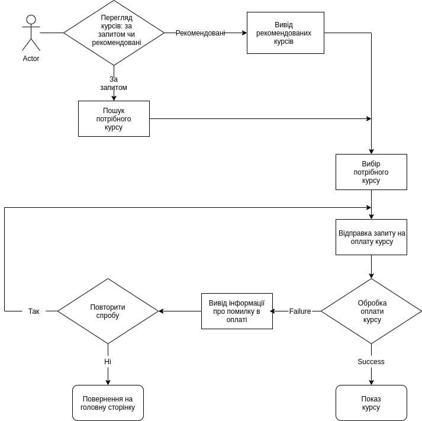

# EduWorld
## Опис
EduWorld - це українська освітня платформа і конструктор безкоштовних відкритих онлайн-курсів і уроків. Вона дає можливість будь-якому зареєстрованому користувачеві долучитись до будь-якого наявного курсу і отримати сертифікат або створити власний курс.
## Актуальність
В умовах сучасних реалій виникає необхідність бути обізнаними в усіх сферах діяльності, а також розиватися професійно, тож освітня платформа є надзвичайно актуальною.
## Функціонал
Зареєстрований користувач має два варіанти використання EduWorld:
* приєднатись до вже наявних уроків як звичайний користувач;
* створити власний курс при умові що реєстрація була пройдена як викладач чи адміністратор;

Кожен курс може містити відео чи текстові уроки, завдання з автоматичною перевіркою та зворотнім зв'язком. Наявний також чат для обговорення завдань та форум для питань викладачам.
## Стек технологій
### Frontend
* **React**
Було обрано React, тому що це найкращий варіант для невеликого веб-додатка, який буде швидко працювати за рахунок Virtual DOM, що використовується в цій бібліотеці.
* **TypeScript**
Зараз мало використувують VanillaJS, бо по мірі розширення веб-додатку все складнішим стає відслідковування правильних типів, передача props, помилки виникають тільки на етапі компіляції. При використанні TypeScript ці всі помилки можна побачити ще до компіляції, вони будуть підсвічуватись у вашому редакторі коду і це дуже пришвидшує написання коду та виправленення багів.
* **Redux/Hooks**
Redux - зручна бібліотека для управління стейтом у веб-додатку. Було обрано її, тому що вона дозволяє структурувати код і винести state за межі компонентів.
* **Redux Thunk/SWR**
Redux Thunk більше підходить, тому що ця технологія набагато простіша, ніж Saga, і її повністю вистачить для даного проекту.
* **Styled Components**
Це найсучасніший спосіб стилізації компонентів(так званий css in js). Він дозволяє позбутися .css файлів і перенести всі стилі безспосередньо до файлу з компонентом.
### Backend
* **Fastapi**
FastAPI - це сучасний, швидкий (високопродуктивний) веб-фреймворк для створення API з Python 3.6 + на основі стандартних підказок типу(type hints) Python.
* **Gino**
GINO - GINO Is Not ORM - легкий асинхронний ОРМ побудований як надбудова на SQLAlchemy Core для Python asyncio. Зараз  GINO підтримує тільки один діалект asyncpg.
* **Alembic**
Alembic - це легкий інструмент міграції баз даних для використання з SQLAlchemy database Toolkit for Python.
* **Postgresql**
PostgreSQL - це потужна об'єктно-реляційна система баз даних з відкритим вихідним кодом.
## _Блок-схема:_

## Timeline
* **Лютий**
Створення UI/UX-дизайну та проектування бд
* **Березень**
Підготовка базових компонентів та написання стилів.
Ендпоінти реєстріції та утентифікації
* **Квітень**
Налаштування стейт менеджменту та роботи з API.
Реалізація основного функціоналу бекенду
* **Травень**
Пошук багів та тестування.
* **Червень**
Деплой на Heroku.